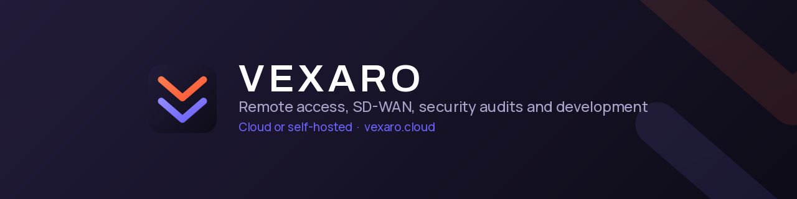

  

p>

  a>
    a>
      a>
        a>

p>

<h3 align="center">A secure IT foundation for modern business</h3>h3>

Vexaro is built by engineers who spent years running production infrastructure and testing its security — 
and who wanted remote access that IT teams could actually keep inside their own perimeter.

p>

---

## Four products, one ecosystem

| Product | What it does |
| :--- | :--- |
| **Vexaro Desk** | Remote access and support. Attended and unattended access, operator roles, access approval, audit logs, session recording. Cloud or self-hosted. |
| **Vexaro Mesh** | SD-WAN and site connectivity. Full mesh between offices, data centers and clouds, with traffic segmentation and auto-failover. |
| **Vexaro Security** | Security audits, penetration testing, certification readiness, ongoing security support. |
| **Vexaro Development** | Custom software, internal systems, integrations and infrastructure — delivered and run by our own engineers. |

## Vexaro Desk

**Remote desktop and support that feels local.** Connect to PCs, servers and devices, keep every session accountable, and choose where it runs.

### In session

| Capability | Detail |
| :--- | :--- |
| Remote control | Full access to screen, mouse and keyboard |
| View only | Watch the screen without intervening |
| File transfer | Drivers, documents, patches, utilities, logs |
| Chat | Talk inside the session without messengers |
| Multi-monitor | Workstations with two or more screens |
| Device reboot | Restart the device and return to the session |

### Access and security

| Capability | Detail |
| :--- | :--- |
| Encryption | 256-bit on every session |
| Two-factor authentication | An extra verification factor for operator sign-in |
| Access roles | Different access levels for staff |
| Connection consent | Explicit approval before a session on user devices |
| One-time codes | Attended support never turns into standing access |
| File control policies | Allow or block transfer by role, device or policy |
| Unattended access | Connect to devices with no user present |

### Audit

| Capability | Detail |
| :--- | :--- |
| Session logs | Connections, duration, device, operator, access type |
| Session recording | Video evidence for investigations, training and proof of work |
| Export | PDF export and SIEM forwarding |
| Device organization | By client, department, branch or project |

## Platform support

| Platform | Requirement |
| :--- | :--- |
| Windows | Windows 10+, 64-bit |
| macOS | macOS 12+, Apple Silicon and Intel |
| Linux | Ubuntu 22.04+, Debian 12+, Fedora 38+ |
| Android | Android 10+ |
| iOS | iOS 16+ |
| Browser | Connect from the browser, no download needed |

## Cloud or self-hosted

| | Cloud | Self-hosted |
| :--- | :--- | :--- |
| Servers to deploy | None | Yours |
| Routing | Managed | Under your control |
| Logs and recordings | Managed | Stay inside your perimeter |
| Best for | Teams that want it working today | Regulated, air-gapped or sovereignty-bound estates |

Enterprise rollout supports MDM, SCCM, Group Policy and silent installation.

## Status

Native installers are currently in **private beta**. Browser-based access is available today. Join the waitlist per platform at [desk.vexaro.cloud/en/download](https://desk.vexaro.cloud/en/download).

## Links

| | |
| :--- | :--- |
| Website | [vexaro.cloud](https://vexaro.cloud) |
| Vexaro Desk | [desk.vexaro.cloud](https://desk.vexaro.cloud) |
| Documentation | [desk.vexaro.cloud/en/docs](https://desk.vexaro.cloud/en/docs) |
| Trust center | [desk.vexaro.cloud/en/trust-center](https://desk.vexaro.cloud/en/trust-center) |
| Contact | social@vexaro.cloud |

Vexaro, LLCsub>
p>

